# US 26 - Como Gestor Agrícola, pretendo que a criação ou alteração de um registo de uma operação deva ser registado num log que indique o instante, tipo de operação e todos os dados relacionados com a operação (e.g. data da operação, parcela, etc.).

## Análise do Requisito
Nesta Us foram criados triggers para cada um dos tipos de operacao (semeadura, plantacao, colheita, monda, movimentacao do solo, rega, fertirrega, aplicacao de fator de producao no solo e na cultura) que inserm numa tabela de log comum com os dados importantes para cada operacao.

## Tabela de logs de operacao

## Trigger de insercao de operacao

### Semeadura
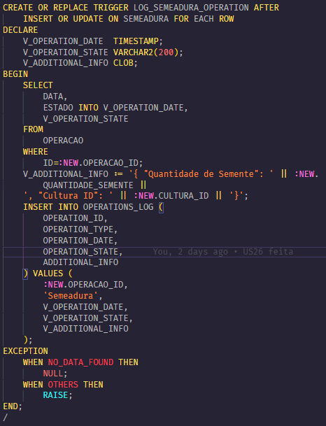

### Plantacao
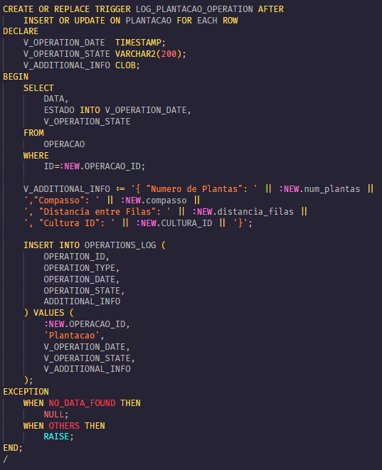

### Colheita
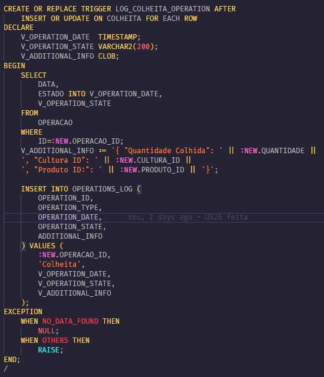

### Monda
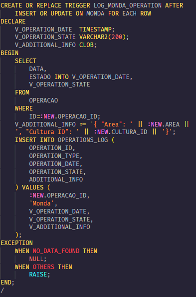

### Movimentacao do solo
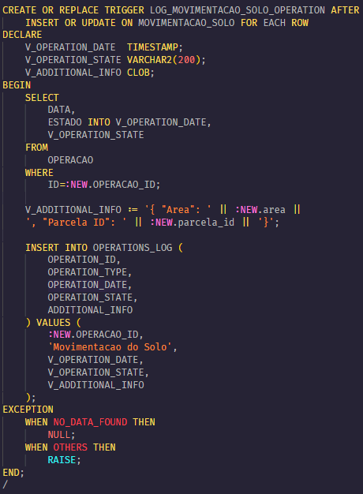

### Rega
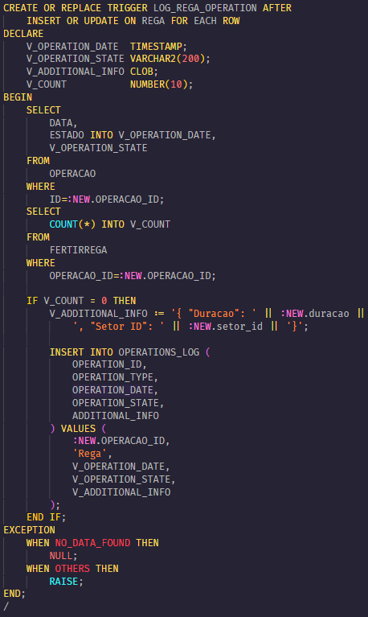

### Fertirrega
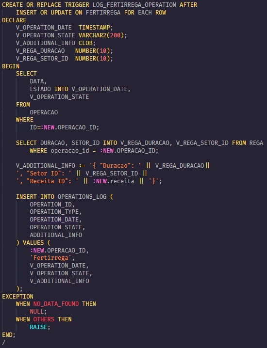

### Aplicacao de fator de producao no solo
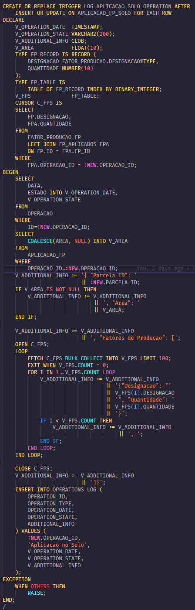

### Aplicacao de fator de producao na cultura
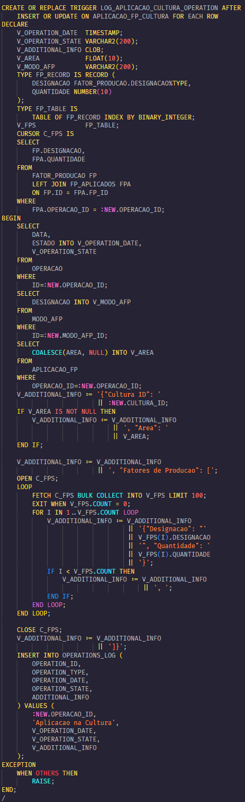

## Exemplo de log de operacao

### Insercao de uma operacao de semeadura
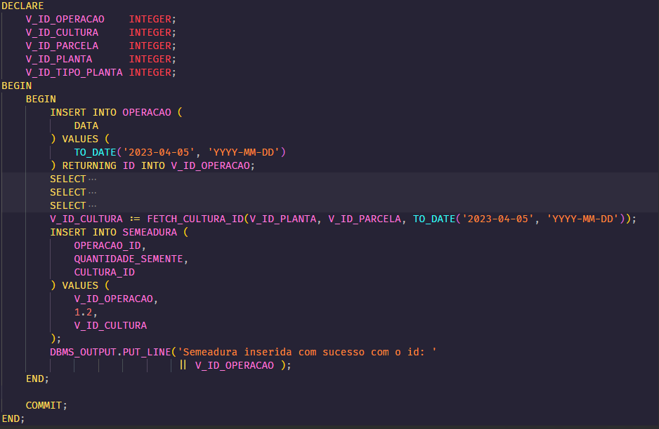
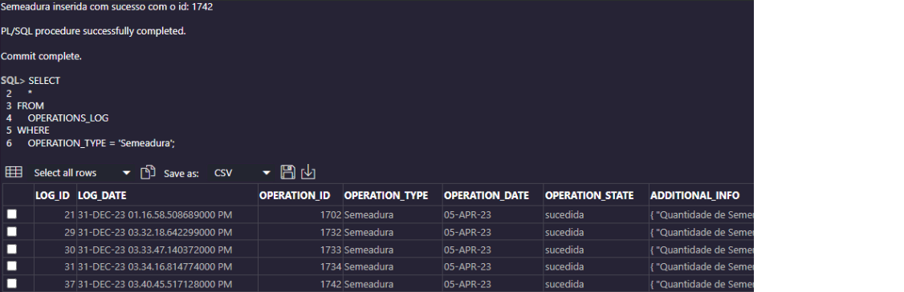

### Insercao de uma operacao de plantacao
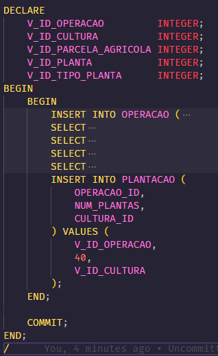
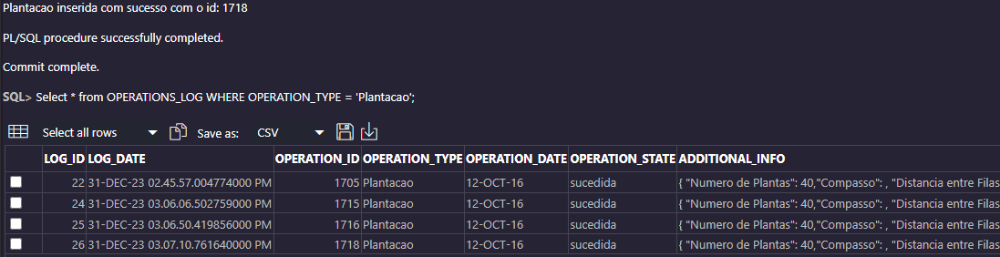

### Insercao de uma operacao de colheita
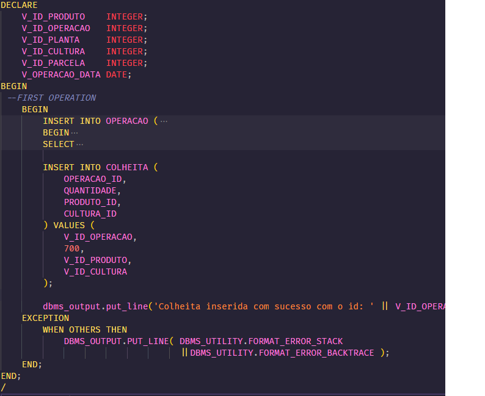
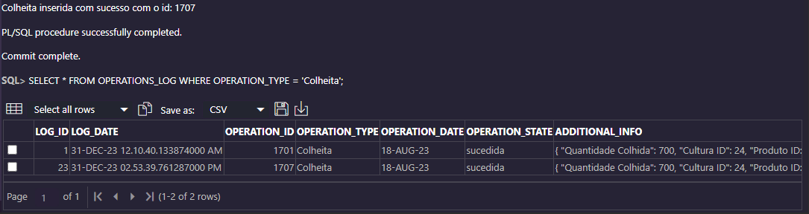

### Insercao de uma operacao de monda
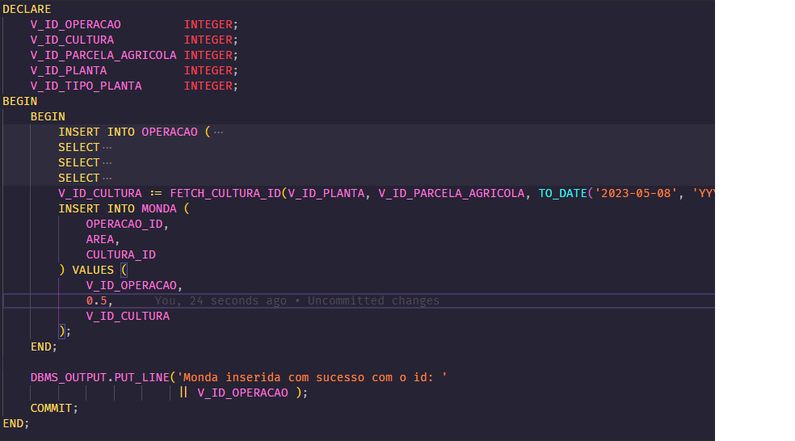
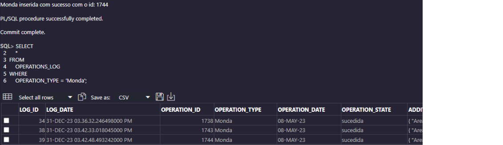

### Insercao de uma operacao de movimentacao do solo
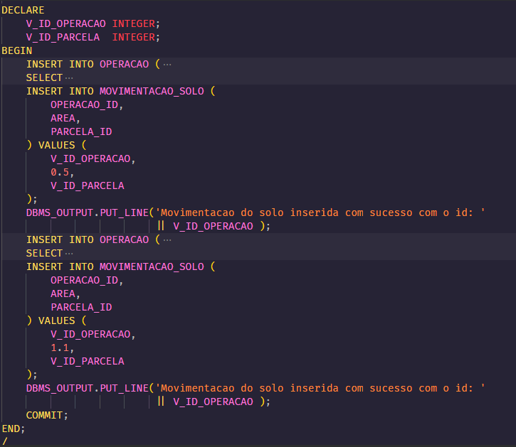
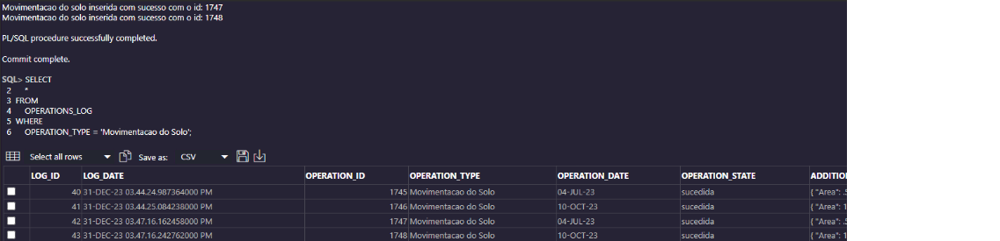

### Insercao de uma operacao de rega
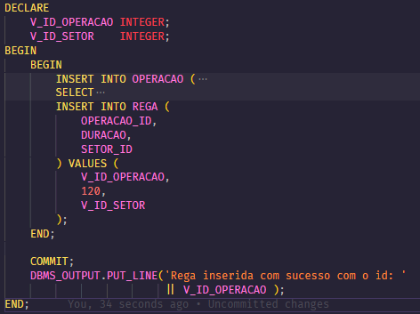
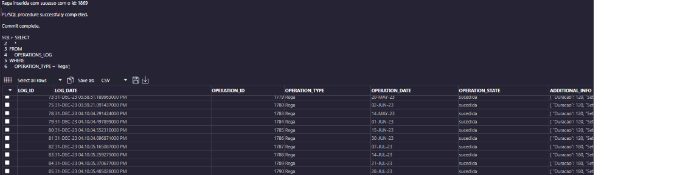

### Insercao de uma operacao de fertirrega
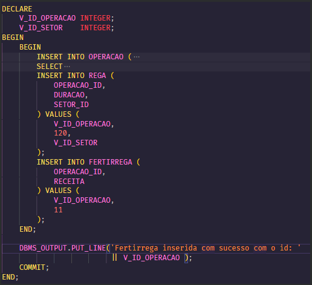
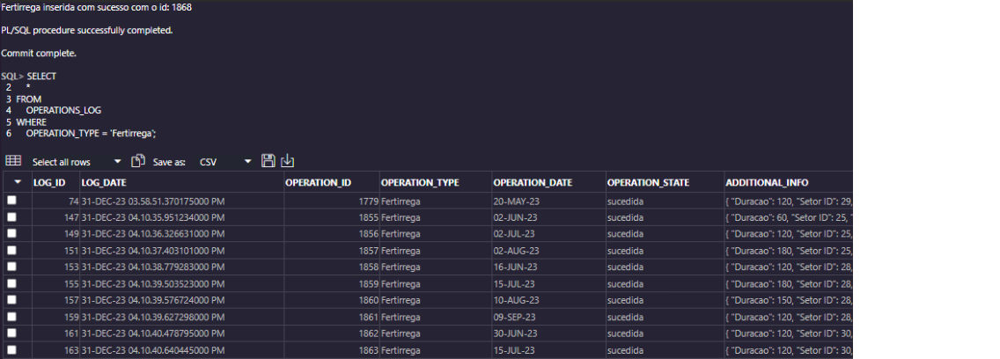

### Insercao de uma operacao de aplicacao de fator de producao no solo
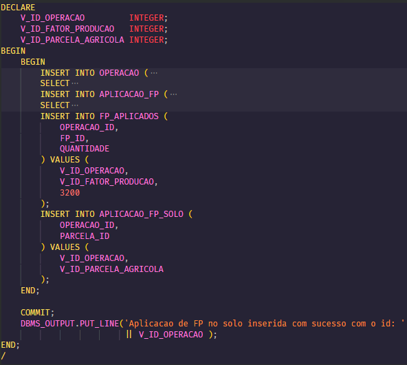

### Insercao de uma operacao de aplicacao de fator de producao na cultura

