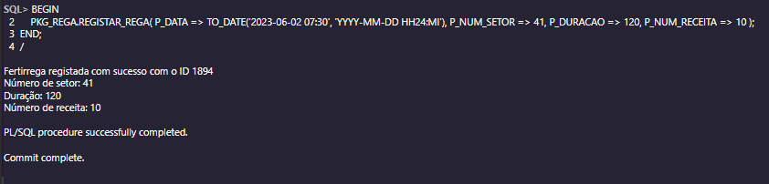

# US 32 - Como Gestor Agrícola, pretendo registar uma operação de rega, incluindo a componente de fertirrega (se aplicável).

## Análise do Requisito
Nesta US foram criados dois procedures para registar uma operacao de rega, um para rega simples e outro para fertirrega. Os dois procedures têm o mesmo nome e recebem os mesmos parametros, mas o procedure de fertirrega tem um parametro adicional para número da receita.

## Código

### Package com os procedures

### Procedure de rega

### Procedure de fertirrega

